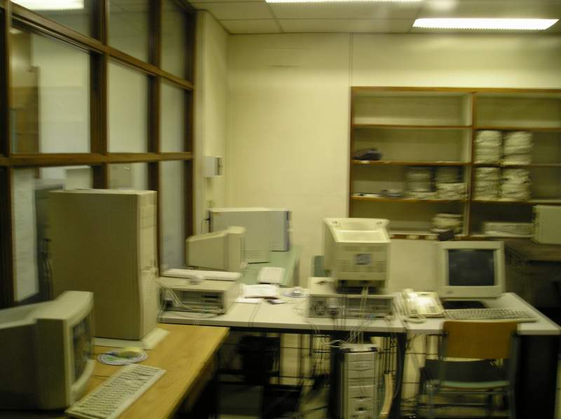
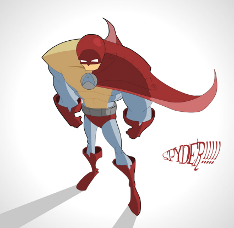
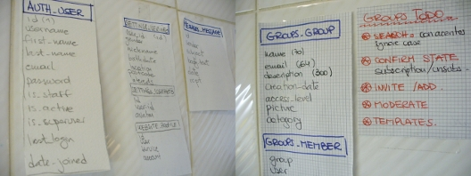

Blog
====

## Aquellos viejos tiempos
_03/2007_

La facultad terminó hace ya varios meses, y recién ahora puedo sentarme a
pensar en aquellos proyectos que me hubiera gustado hacer. A pesar de que a
veces, mientras cursamos, nos parece que "tenemos tiempo". Pero entre trabajo,
viaje, clases, los dí­as pasan rápido y los exámenes se acercan a los tumbos.
Y cuando llegan las vacaciones, necesitamos exactamente eso: vacaciones,
relajarnos para empezar un nuevo año con nuevas energí­as.

Sin embargo, en aquellos tiempos pasados, con otros compañeros llegamos a
instalar Hendrix, un servidor donde tuvimos un principio de sitio web, wiki,
grupos, con la idea de crear una comunidad para alumnos de Ingenierí­a en
Informática y Licenciatura en Análisis de Sistemas. Pero por falta de recursos
y organización, el proyecto nunca salió a la luz.

 
**Hendrix, atrás a la izquierda, en sus momentos gloriosos**

Viendo la actual explosión de "redes sociales", al estilo Linkedin, Facebook,
la vieja idea de crear una comunidad se despertó. Me puse a investigar un
poco, y encontré que ya hay varias universidades con sitios webs de
comunidades virtuales de sus alumnos y hasta profesores.

Esta es una lista borrador de lo que vi:
  - Usuarios de la comunidad (ej: alumnos, profesores, etc)
  - Los usuarios tienen un profile, etc, etc.
  - Estos usuarios pueden buscar otros usuarios, agregarlos a su red,
    buscarlos por gustos, carrera, etc.
  - Se forman grupos, los usuarios pertenecen a grupos, pueden crearlos, etc.
  - Y... cualquier otro módulo que se quiera agregar.

## Manos a la obra
_07/2007_

 
**¡No hace falta ser super héroes para hacer super cosas!**

Muy seguido tenemos ideas para cambiar o crear cosas, y quedan en la nada.
Quizás nos gana la ansiedad y lo que nos rodea nos hace pensar que todo se
inventó de manera muy fácil (o sin dificultades) y muy rápido. Sin embargo, si
estamos convencidos de hacer algo (¡pero realmente convencidos!), nuestra
decisión a hacer nos dará fuerza para dar el primer paso y seguir adelante.

Pasaron unos meses desde que retomé la idea de desarrollar una comunidad, y a
pesar de que no haya trabajo visible, he estado mirando sitios webs para ver
los diseños, colores y contenidos que se usan ahora. Mis habilidades en diseño
gráfico son casi nulas, pero tengo paciencia y perseverancia para aprender :).
También comencé a esbozar la base de datos.

¡Allá vamos!

## Diseñando
_08/2007_

Diseñar antes de programar ¡es esencial! Las pantallas y los formularios los
elaboro según este interesante artí­culo:
[Paper Prototyping](http://www.alistapart.com/articles/paperprototyping).

Así­ que mis herramientas bien básicas: ¡papel y lápiz, tijerita, cinta
adhesiva y una buena pared!

 
**La base de datos mostrando orgullosa sus tablas**

También es muy práctico para diseñar la base de datos. Ahhh, pero no tan fácil
el diagrama de entidad relación resulta hacer, mi joven padawana.

## Es más fácil con GNU/Linux
_08/2007_

 
**Tux es un tiernito**

Siempre tuve ganas de pasarme completamente a Linux. A pesar de que hace ya
unos años aprendí­ a utilizar varios comandos e instalar servicios, siempre
temí­ que a nivel escritorio no funcionara como Windows. En algún tiempo, por
trabajo y por gusto, tení­a los dos sistemas operativos instalados y mediante
una máquina virtual podí­a usar los dos.

Pero finalmente me decidí­, y hace poco, no sin esfuerzo (porque todo lo nuevo
lleva su tiempo aprender), instalé Debian en mi computadora. Y aunque paso
tiempo "re-aprendiendo" (por ejemplo, para cerrar una ventana hay que
hacerlo del lado izquierdo), ¡lo gano por otro lado!

Es un placer instalar y configurar Apache rápido y fácil, así­ como un wiki,
manejar todo desde la consola... nunca me resultó tan fácil programar. Demás
está decir que esto me ayuda mucho para desarrollar el proyecto, ya que me
ahorra mucho tiempo para instalar y usar herramientas como
[Subversion](https://subversion.apache.org/) y
[Trac](https://trac.edgewall.org/).

## ¿Importa el nombre?
_09/2007_

 
**No es el mismo perfume, pero prefiero los pensamientos**

Alguna vez compré "Romeo y Julieta", de Shakespeare. Nunca me atrajo la
poesí­a, pero después de haber visto la pelí­cula, quise aprovechar mi
entusiasmo para leer algo diferente. La lectura no tuvo éxito, pero siempre
voy a recordar estos versos:

> **Juliet**: 
> "What's in a name? That which we call a rose 
> By any other name would smell as sweet." 
>  
> _Romeo and Juliet (II, ii, 1-2)_

¿A qué viene esto? ¡A que no tengo un nombre para el proyecto! Si siguiera los
pensamientos de Julieta, cualquier nombre bastarí­a. Sin embargo, en este
caso, el nombre sí­ importa. Estamos haciendo un sitio para la comunidad de
FIUBA; es importante que haya algo identificatorio en el nombre. No se puede
llamar de cualquier forma.

Luego de noches y noches exprimiendo el cerebro (nunca fui creativa con las
palabras), recuerdo el momento, acostada, mirando el techo, el velador
encendido, la angustia flotando.

Y sin querer, como si siempre hubiera estado ahí­, pronuncié:

> **fiubar**: 
> Estudiar en la Facultad de Ingenierí­a, Universidad de Buenos Aires
> (FIUBA).

Repetí­ "fiubar", despacito, para acostumbrarme a la palabra, fiubar,
fiubar... Jaja, ¡sí­! ¡Es genial! Quién lo hubiera dicho, tan fácil, tan
simple, fiubar, ¡iupi!

Ahora que tení­a el nombre, podí­amos pasar al logo, tan importante como el
nombre. Ah, no, señores, sin nombre y logo, ¡no hay proyecto!

## ¿Qué lenguaje para programar?
_10/2007_

 

En realidad ya tengo la respuesta, y es **python**. ¿Por
qué? Además de ser open source, porque me gusta más la sintaxis, la tabulación
me da una impresión de prolijidad, y he visto varias aplicaciones cientí­ficas
escritas en este lenguaje.

Para aprender, nada mejor que instalarlo, y leer
[un tutorial](https://wiki.python.org/moin/BeginnersGuide)
escrito por su creador y un libro online
[Dive into Python](http://www.diveintopython.net/)
(¡y programar ejercicios hasta el dominio absoluto!).

Un gran método que me acompaña para explorar los atributos y métodos de un
módulo u objeto: `dir([object])`.

## Django
_11/2007_

 

Así­ como existe Ruby on Rails (que a mi parecer es mucho más
conocido), dentro de la categorí­a de
[web frameworks](http://es.wikipedia.org/wiki/Framework), tenemos a
[Django](http://www.djangoproject.com/), escrito en python.

Django tiene documentación muy completa, lo que facilita y agiliza su
aprendizaje. También tiene una comunidad cada vez más popular, que comparte
módulos o "mini-aplicaciones" que pueden ser fácilmente ensamblados a nuestro
proyecto. De esta manera, podemos usar el código de otros (que gentilmente lo
han hecho público, ¡gracias! ¡ese es el espí­ritu!), y así­ avanzar en
nuestro desarrollo (o por lo menos, ¡a mí­ me simplifica mucho el trabajo!).

Para aprender a programar en Django,
[los tutoriales](https://docs.djangoproject.com/en/dev/intro/)
que están en la página te van a dar una muy buena base.
